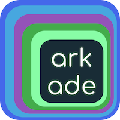

# terraform-do-openfaas-keyclock

Running OpenFaas PRO with SSO on DigitalOcean with ArgoCD

# Install Taskfile

    brew install go-task/tap/go-task

# Install arkade

arkade provides a portable marketplace for downloading your favourite devops CLIs and installing helm charts, with a
single command.

Install Arkade via:

    curl -sLS https://get.arkade.dev | sudo sh

# Install ArgoCD Autopilot

To get the `latest` version we call arkade with the version flag.

    arkade get argocd-autopilot -v 0.2.13

After the download of the argocd-autopilot just follow the steps of arkade to move the binary in your `/usr/local/bin/`
folder.

# Create K3S cluster

Install the `terrafrom` cli, via arkade:

     arkade get terraform -v 1.0.4 

Same steps like with the `argocd-autopilot` binary.